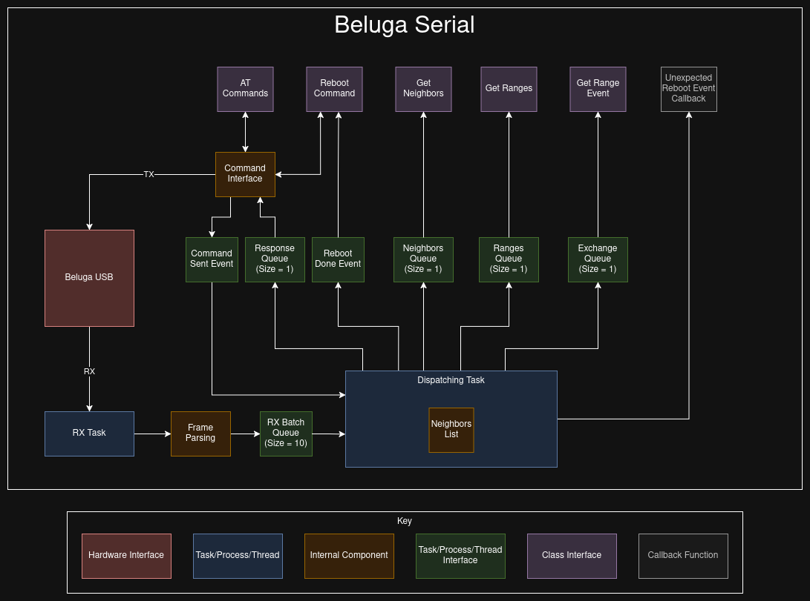
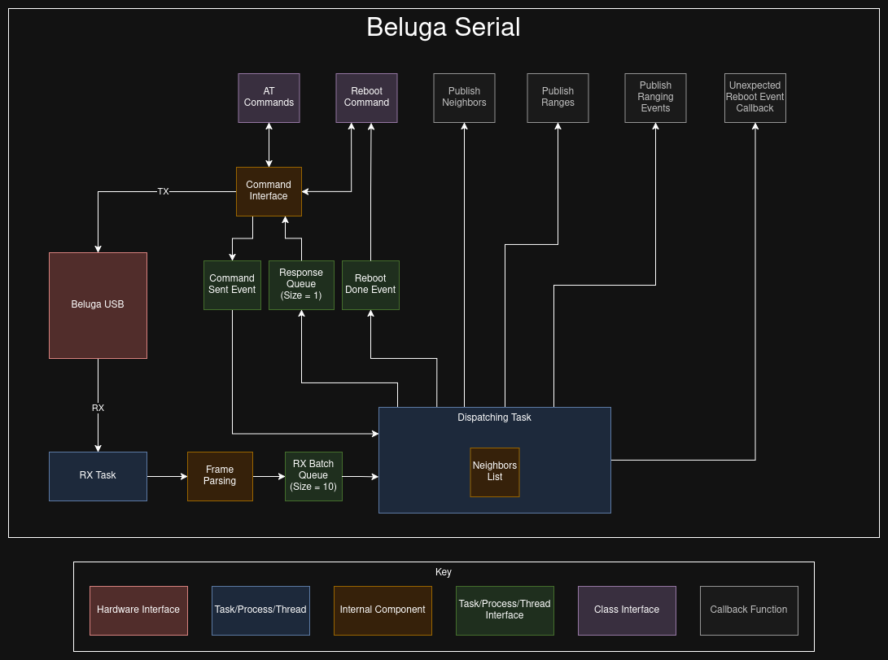

--------------------------------------
Beluga Serial Communications Libraries
--------------------------------------

This folder contains the libraries built to assist with serial communications with Beluga. They are designed
to quickly parse and publish the messages from Beluga.  The libraries give 2 options for receiving messages from
Beluga:

1. Reception Queues.
2. Callback functions.

Architectures
--------------------
Architecture using Queues
^^^^^^^^^^^^^^^^^^^^^^^^^

Architecture using Callbacks
^^^^^^^^^^^^^^^^^^^^^^^^^^^^

