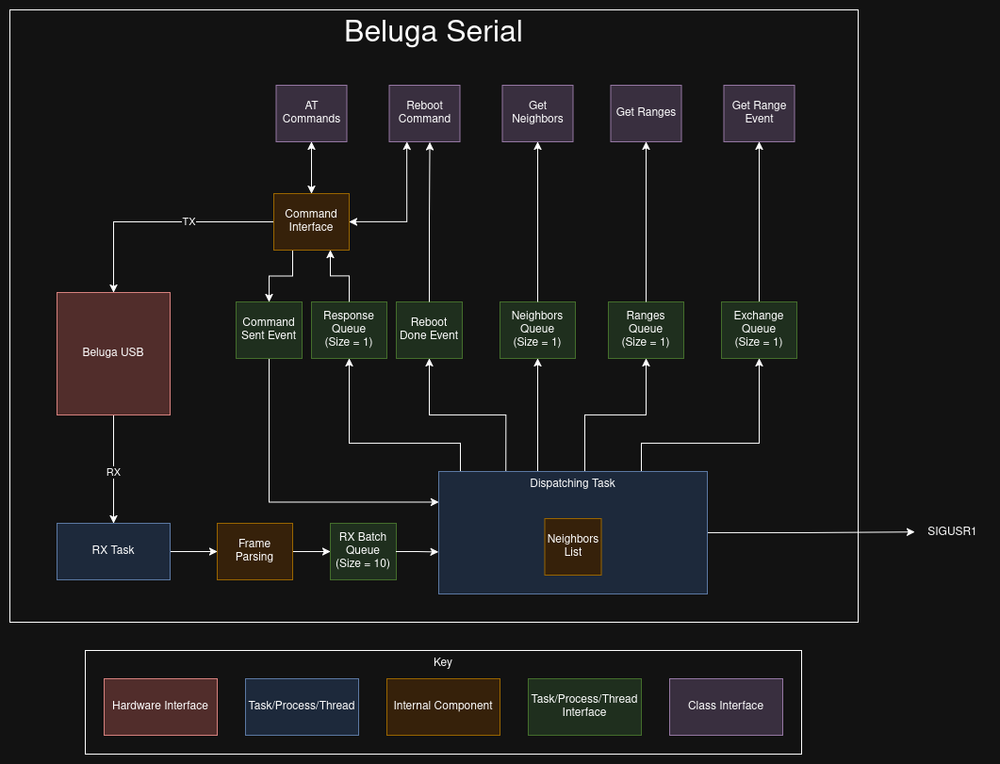
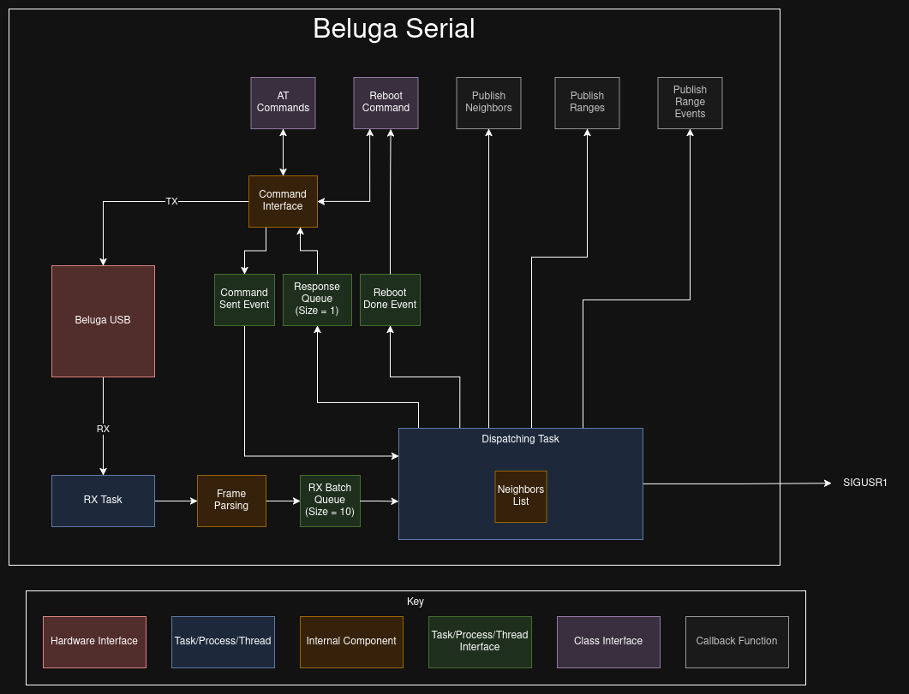

--------------------------------------
Beluga Serial Communications Libraries
--------------------------------------

This folder contains the libraries built to assist with serial communications with Beluga. They are designed
to quickly parse and publish the messages from Beluga. In order to use these libraries, the Beluga firmware
must be compiled with message frames enabled. Additionally, pay attention to the architectures of the libraries
as they may not work as intended in your application. The libraries give 2 options for receiving messages from
Beluga:

1. Reception Queues.
2. Callback functions.

Depending on the application, you may be limited to option 1. Frames can be enabled in the firmware by adding
the following line in the prj.config file:

.. code-block::

    CONFIG_BELUGA_FRAMES=y

Python Architectures
--------------------
Architecture using Queues
^^^^^^^^^^^^^^^^^^^^^^^^^

Architecture using Callbacks
^^^^^^^^^^^^^^^^^^^^^^^^^^^^

